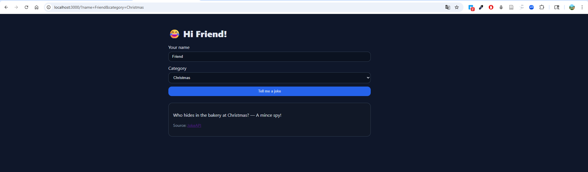

# API Capstone (Express + EJS + Axios)

## Run
1. `npm i`
2. `npm run dev`  → http://localhost:3000

## Tech
- Express (server)
- EJS (templating)
- Axios (HTTP client)
- Static assets served from `/public`

## Change API
Edit the Axios call in `index.js` to use your preferred public API.

## Steps to pull the LICENSE file locally
1. Make sure you are inside your project folder in VS Code terminal:

    - cd path/to/your/project

2. Fetch the latest changes from GitHub:

    - git fetch origin

3. Merge or pull into your local main branch:

    - git pull origin main

This downloads the LICENSE file you created on GitHub into your local repo.git